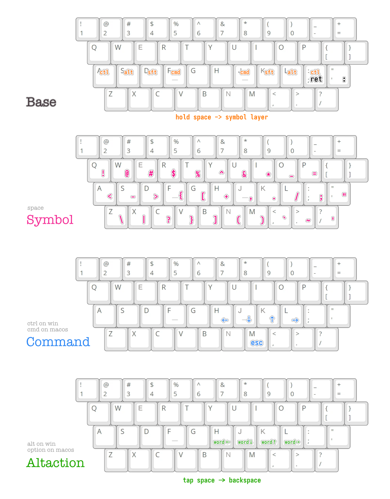

# Koiro's Kanata keyboard remapper tools config

[Kanata](https://github.com/jtroo/kanata/tree/main?tab=readme-ov-file)
is a cross-platform software keyboard remapper for Linux, macOS and Windows.

## Run

After installing Kanata. Run:

```
kanata -c koiro.kbd
```

## Config Preview


